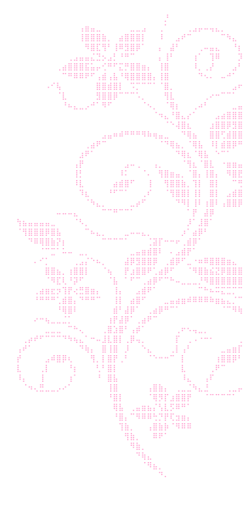

<!-- Gothic white border (top) -->

<h1>Hey 👋 I'm Pietro</h1>

Software Developer • Full-Stack &amp; AI

<!-- RGB typing animation: types, deletes, loops -->

 

<!-- Animated art (white, floating) -->

### 👨‍💻 About Me

- 💻 **Full-Stack & Desktop**: Building .NET (C#) applications with Entity Framework and 3-tier layered architecture, as well as Flutter & MySQL solutions.
- 🤖 **AI-Native Engineering**: Integrating AI models behind deterministic guardrails, automated regression testing, and agent-assisted workflows.
- 🗄️ **Databases**: Solid experience with MySQL, SQL Server, PL/SQL, schema design, and query optimization.
- 🎮 **Game Dev & IoT**: Developing interactive games in **Godot** & **Unity**, and tinkering with embedded systems on **Raspberry Pi**.

<h3 align="center">🛠️ Technical Skills</h3>

<!-- Languages & Frameworks -->

  

<!-- Databases, Tools & Game Engines -->

<!-- Pac-Man Arcade -->
<picture>
  <source
    media="(prefers-color-scheme: dark)"
    srcset="https://raw.githubusercontent.com/PietroDev-lab/PietroDev-lab/output/pacman-contribution-graph-dark.svg"
  />
  <source
    media="(prefers-color-scheme: light)"
    srcset="https://raw.githubusercontent.com/PietroDev-lab/PietroDev-lab/output/pacman-contribution-graph.svg"
  />
  
</picture>

  

<!-- Contribution Snake -->
<picture>
  <source
    media="(prefers-color-scheme: dark)"
    srcset="https://raw.githubusercontent.com/PietroDev-lab/PietroDev-lab/output/github-snake-dark.svg"
  />
  <source
    media="(prefers-color-scheme: light)"
    srcset="https://raw.githubusercontent.com/PietroDev-lab/PietroDev-lab/output/github-snake.svg"
  />
  
</picture>

<h3 align="center">📊 GitHub Analytics</h3>

<!-- Streak Stats (Pitch Black Theme) -->

  

<!-- Stats & Top Languages (Pitch Black Theme) -->

&nbsp;

<!-- Gothic white border (bottom) -->

